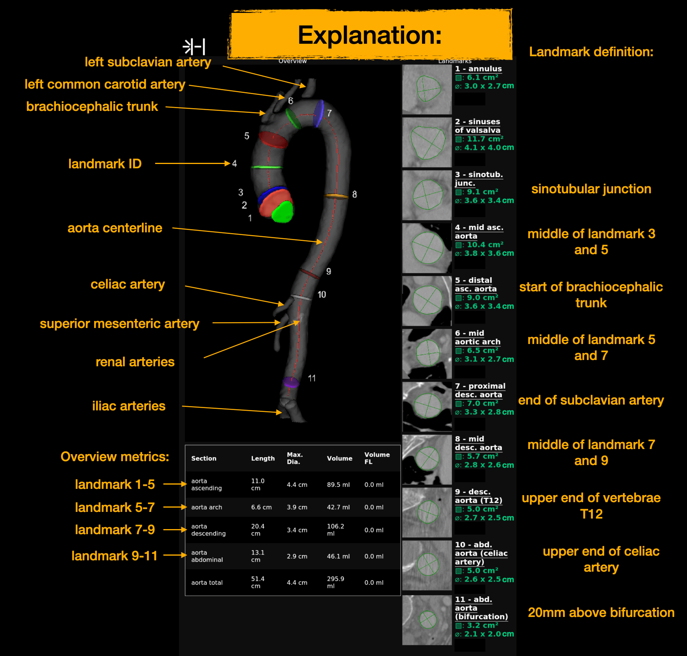

# Aorta report

`totalseg_aorta_report` creates a quantitative report of the thoracic and abdominal aorta from a
CT image. It places 11 standardized landmarks along the aortic centerline, measures the vessel at
each landmark, summarizes the main aortic sections, and renders the results as JSON and an RGB
NIfTI report. It can also generate a curved planar reformation (CPR).

The report is a research prototype and is not intended for clinical diagnosis.
For research use, cite the
[TotalSegmentator paper](https://pubs.rsna.org/doi/10.1148/ryai.230024).



## Outputs

- RGB NIfTI report (`-o`) with rotating 3D views and landmark cross-sections
- JSON measurements (`-j`)
- processing log (`-l`)
- optional CPR overview PNG (`-c`)
- optional animated CPR NIfTI (`-ca`)

## Requirements

The input must be a three-dimensional CT NIfTI image. DICOM and in-memory inputs are supported by
the Python generator, while the command-line interface expects a NIfTI path.

Running the segmentation models requires a TotalSegmentator license. A license is free for
non-commercial use and can be requested at
[backend.totalsegmentator.com/license-academic](https://backend.totalsegmentator.com/license-academic/).
Configure it once with:

```bash
totalseg_set_license -l aca_XXXXXXXX
```

The report renderer requires `wkhtmltopdf` and a virtual X server. On Ubuntu/Debian:

```bash
sudo apt-get install wkhtmltopdf xvfb
```

Contrast-phase detection requires `xgboost`:

```bash
pip install xgboost
```

## Running the complete pipeline

Use `--run_models` to create all required masks from the CT:

```bash
totalseg_aorta_report \
  -i ct.nii.gz \
  -o aorta_report.nii.gz \
  -j aorta_report.json \
  -l aorta_report.log \
  -c aorta_cpr.png \
  --run_models
```

Patient metadata can optionally be supplied with `-n nodeinfo.json`. Without it, anonymous default
metadata is used. The metadata is displayed in the rendered report and included in the JSON.

## Reusing existing masks

Model inference can be skipped with `--rois_totalseg <dir> --rois_details <dir>`.
The first directory contains the aorta, branch-vessel, iliac-artery, and T12 masks; the second
contains the annulus, sinotubular junction, and optional true-/false-lumen masks.

## How it works

`--rois_totalseg` must contain these binary NIfTI masks:

- `aorta.nii.gz` (or the filename selected with `--aorta_fn`);
- `brachiocephalic_trunk.nii.gz`;
- `subclavian_artery_left.nii.gz`;
- `common_carotid_artery_left.nii.gz`;
- `celiac_trunk.nii.gz`;
- `superior_mesenteric_artery.nii.gz`;
- `renal_arteries.nii.gz`;
- `iliac_artery_left.nii.gz`;
- `iliac_artery_right.nii.gz`;
- `vertebrae_T12.nii.gz`.

`--rois_details` must contain:

- `annulus_proper.nii.gz` (or the filename selected with `--annulus_fn`);
- `sinotubular_junction.nii.gz`;
- optionally, `aorta_true_lumen.nii.gz` and `aorta_false_lumen.nii.gz`.

Required structures may be represented by empty masks when they are outside the field of view. The
file must still exist; dependent landmarks and sections will then be reported as unavailable.
`brachiocephalic_trunc.nii.gz` is accepted as a compatibility spelling for
`brachiocephalic_trunk.nii.gz`.

## Segmentation pipeline

With `--run_models`, processing proceeds as follows:

1. A fast `total` task segments the aorta and heart to define a crop.
2. The CT is cropped with a 20 mm margin around the aorta and heart.
3. The cropped CT is resampled to 0.8 mm isotropic spacing.
4. The normal `total` task produces the aorta, branch vessels, iliac arteries, and T12 masks.
5. The licensed `aortic_dissection` task (model 716) produces true- and false-lumen masks.
6. The licensed `aorta_annulus` task (model 713) produces the annulus and sinotubular junction.
7. The licensed `renal_arteries` task (model 710) produces the celiac trunk, superior mesenteric
   artery, and renal arteries.
8. `totalseg_get_phase` classifies the contrast phase.

The model commands run sequentially by default. `--models_parallel` starts independent
TotalSegmentator processes concurrently. Existing outputs in the temporary model directory are
reused, making interrupted or cached runs resumable.

The internal `--test basic` mode resamples the cropped CT to 1.5 mm instead of 0.8 mm. It is used
for the fixture-based test and is not intended for normal report generation.

## Preprocessing and centerline

All images are mapped to the annulus image grid, which is converted to canonical orientation,
cropped around the largest aorta component, and resampled to 0.8 mm. Binary masks use nearest
neighbor interpolation; the CT uses cubic interpolation.

The aorta mask is completed with available true- and false-lumen predictions and hole filling. The
mask is then dilated and Gaussian-smoothed before skeletonization. The longest path through the
skeleton graph is used as the aortic centerline. The path is ordered from the abdominal end toward
the heart, connected to the annulus center, and resampled at approximately 1 mm intervals for CPR
diameter profiles.

Branch-vessel endpoints are projected onto this centerline. If a required structure is empty, too
small, or does not intersect the aorta, its dependent landmarks are marked unavailable instead of
being estimated.

## Landmark definitions

The report follows 11 positions from the aortic root to the abdominal bifurcation:

1. **Annulus** — the annulus mask at the cardiac end of the centerline.
2. **Sinuses of Valsalva** — the maximum-diameter position between the annulus and sinotubular
   junction, excluding a 10 mm margin at both ends. The midpoint is used when this interval is too
   short.
3. **Sinotubular junction** — the centerline position closest to the sinotubular-junction mask.
4. **Mid ascending aorta** — halfway between landmarks 3 and 5.
5. **Distal ascending aorta** — 5 mm before the brachiocephalic-trunk origin.
6. **Mid aortic arch** — halfway between landmarks 5 and 7.
7. **Proximal descending aorta** — 5 mm distal to the left subclavian-artery origin.
8. **Mid descending aorta** — halfway between landmarks 7 and 9.
9. **Descending aorta at T12** — the centerline position closest to the center of T12. If T12 is
   detected below the celiac landmark, a robust fallback places it 10 mm above the celiac position.
10. **Abdominal aorta at the celiac artery** — the upper end of the celiac-artery intersection.
11. **Abdominal aorta near the bifurcation** — 20 mm above the distal centerline endpoint, using the
    right iliac artery to establish that the bifurcation is present.

Landmarks 1-3 depend on the annulus and/or sinotubular-junction masks; landmarks 4-8 additionally
depend on the brachiocephalic trunk, left subclavian artery, or T12; landmarks 9-11 depend on T12,
the celiac artery, or the right iliac artery respectively.

## Landmark measurements

For each available landmark, the code constructs a plane perpendicular to the local centerline.
The annulus plane uses the orientation of the annulus mask itself. The plane is intersected with the
aorta, rotated into a two-dimensional image, closed, and hole-filled.

The following values are stored:

- total, true-lumen, and false-lumen cross-sectional area in cm²;
- maximum diameter and a near-perpendicular diameter in cm;
- corresponding true- and false-lumen diameters in cm;
- diameter endpoints in both voxel and world coordinates.

`--erosion` erodes the measurement mask by one 0.8 mm voxel before constructing the plane. This can
reduce slight over-segmentation but changes all diameter and area measurements.

True/false-lumen measurements are disabled when the lumen masks are absent, when
`--skip_dissection` is set, or when the scan is classified as native/non-contrast. In that case the
complete aorta is treated as true lumen and the false lumen is empty.

## Aortic section measurements

The landmarks define five sections:

- ascending aorta: landmarks 1 to 5;
- aortic arch: landmarks 5 to 7;
- descending aorta: landmarks 7 to 9;
- abdominal aorta: landmarks 9 to 11;
- complete aorta: landmarks 1 to 11.

For each available section, the report computes centerline length in cm, maximum diameter in cm,
total volume in ml, true-lumen volume in ml, and false-lumen volume in ml. If either boundary
landmark is unavailable, all values for that section are `null`.

For `aorta_total`, the length is bounded by landmarks 1 and 11, but the volume is calculated from
the complete supplied TotalSegmentator aorta mask rather than clipping that mask at the two
landmarks.

## CPR and rendered report

When `--cpr` or `--cpr_animated` is requested, the CT and masks are sampled on planes transported
along the centerline. The CPR overview contains sagittal and coronal straightened views, vessel
contours, landmark positions, and diameter profiles for the complete aorta and both lumens.
The animated CPR NIfTI combines a moving 3D plane, a longitudinal CPR, a diameter profile, and the
current cross-section.

The main NIfTI report contains two sets of 24 frames:

- a rotating 3D overview with the centerline, branch vessels, and landmark planes;
- a rotating true-/false-lumen overview.

Each frame is combined with the landmark cross-sections and section summary in an HTML template,
rendered to PNG, and stored as an RGB slice in the output NIfTI.

## JSON structure

The top-level JSON contains:

- `landmarks`: entries `1` through `11` with names and available measurements;
- `section_stats`: measurements for the five aortic sections;
- `metadata`: normalized patient/study metadata and the report version.

Unavailable measurements are represented as `null`. Diameter endpoint coordinates can vary by a
small amount between runs when several boundary-point pairs have the same diameter.

## Useful options

- `--tmp_dir DIR`: reuse a model/intermediate cache. Without it, a temporary directory is removed
  after a successful run.
- `--debug`: preserve intermediate NIfTI, PNG, and HTML files. Supply `--tmp_dir` when using this
  option.
- `--models_parallel`: run segmentation tasks concurrently; requires substantially more memory.
- `--skip_dissection`: ignore true-/false-lumen masks even when they exist.
- `--erosion`: erode measurement masks by one voxel.
- `--aorta_fn` and `--annulus_fn`: select non-default filenames in the supplied ROI directories.
- `--save_runtime`: write the runtime to `META/runtime.json` next to the nodeinfo file. This option
  has no effect when no nodeinfo path is supplied.

Run `totalseg_aorta_report --help` for the complete command-line reference.

## Limitations

- Report quality depends directly on aorta, branch-vessel, annulus, and landmark segmentation
  quality.
- Missing anatomy or a restricted field of view can make landmarks and complete sections
  unavailable.
- The centerline assumes one dominant connected aortic path; severe discontinuities can produce a
  short or incorrect path.
- Native scans do not use the dissection model output for lumen measurements.
- CPR and 3D rendering are computationally and memory intensive.
- The implementation currently supports local model execution only.
- Input validation currently returns without an error status, so automation should verify that all
  requested output files were created.

